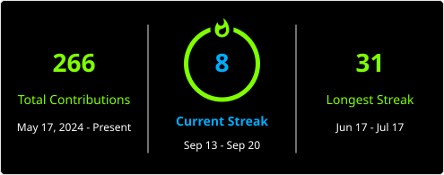

# 🌟Hey there!!!
### Design × Code = Creative Programming 🎨

Hey, I’m Harsh 👋 — an ICT student who loves breaking systems *ethically* and building them *securely*.

🔐 Cybersecurity | 💻 Full-Stack Development | 🐍 Python\
🛠️ C/C++ | JavaScript | React | Docker | Linux | Git

**Design. Build. Break. Secure. Repeat. 🚀**

## 🌐 Socials:
   

# 💻 Tech Stack:
                                                             

# 📊 GitHub Stats:

 

 

### ✍️ Random Dev Quote

